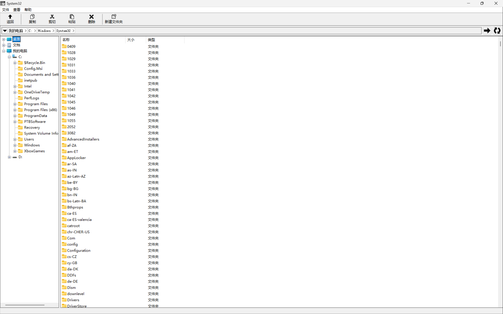

# Tiny File Manager汉化版
此分支为Tiny File Manager做了简单汉化处理，仅支持简体中文

编译时需注意在属性中把"将警告视为错误"设置为否，并且不使用预编译头
程序可运行于Wine环境
# Tiny File Manager
Lightweight file manager for Windows.

## System requirements
* Windows XP SP3 and newer
* Visual C++ Redistributable for Visual Studio 2015

## How to build
To build TFM you will need Visual Studio 2017 with following components installed:
* Desktop development with C++ workload
* Windows XP support for C++
* Windows Universal CRT SDK
* Windows 8.1 SDK (if resource compiler doesn't work correctly)
